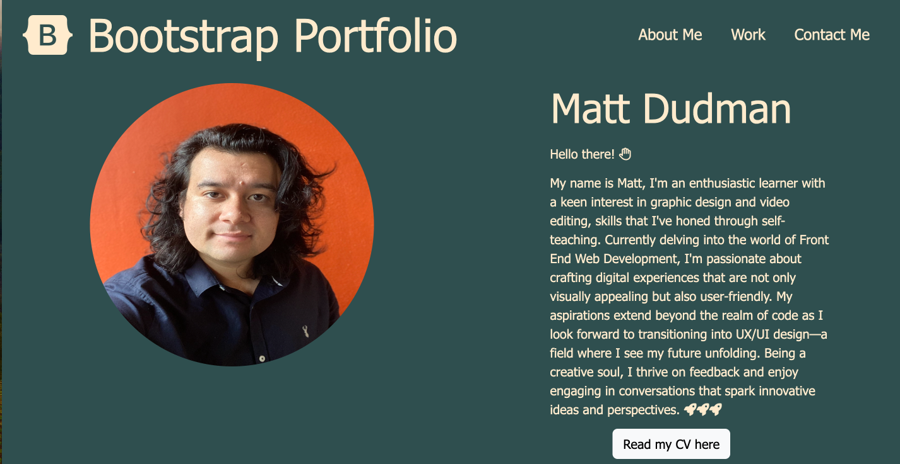

# Bootstrap-Portfolio
Matt Dudman Bootstrap Portfolio
# Matt-Dudman-Portfolio

## Description

Welcome to my Front-End Web Development Portfolio, made with Bootstrap! This portfolio showcases my skills, talents, and various projects, providing a glimpse into my capabilities as a web developer.

## Table of Contents

- [Introduction](#introduction)
- [Installation](#installation)
- [About](#about)
- [License](#license)
- [Deployed Link](#deployed-link)
- [Author](#author)

## Introduction

My goal with this portfolio was to be able to build a website using bootstrap that could take my prevoius portfolio and enhance how it looks and operates. 

## Installation 

N/A

## About

I had an idea from my inital portfolio on how I wanted to build apon this style. 

This was my inital protfolio - 

I liked the colours I used and the lay out I wnated to keep similar but still focus on hitting the requirements for the project. 

 So I drew up these 2 wireframes, one for for Mobile -

 And for Desktop - 

And my final site came out like this - 

I utlised the Icons feature for my Skills section and Contact section as I feel like this is a better more aesthically pleasing way to style items rather than to list text. I also added the box shadow feature to the footer when clicked so it 'glowed.' What I used the most throughout was the box shadow hover psuedo class to create a scrolling colour wash across some of the titles. This is something I was very happy with. 

I did have to change the order of some of the cards and items midway through the process of me buidling the site with bootstrap, and although this was a small hiccup, I learnt from this and feel comfortable in being able to comabt any issues such as that in the future. 

## License

MIT License

Copyright (c) [2023] [Dudman-Matt]

Permission is hereby granted, free of charge, to any person obtaining a copy of this software and associated documentation files (the "Software"), to deal in the Software without restriction, including without limitation the rights to use, copy, modify, merge, publish, distribute, sublicense, and/or sell copies of the Software, and to permit persons to whom the Software is furnished to do so, subject to the following conditions:

The above copyright notice and this permission notice shall be included in all copies or substantial portions of the Software.

THE SOFTWARE IS PROVIDED "AS IS", WITHOUT WARRANTY OF ANY KIND, EXPRESS OR IMPLIED, INCLUDING BUT NOT LIMITED TO THE WARRANTIES OF MERCHANTABILITY, FITNESS FOR A PARTICULAR PURPOSE AND NONINFRINGEMENT. IN NO EVENT SHALL THE AUTHORS OR COPYRIGHT HOLDERS BE LIABLE FOR ANY CLAIM, DAMAGES OR OTHER LIABILITY, WHETHER IN AN ACTION OF CONTRACT, TORT OR OTHERWISE, ARISING FROM, OUT OF OR IN CONNECTION WITH THE SOFTWARE OR THE USE OR OTHER DEALINGS IN THE SOFTWARE.

## Deployed Link
TBC

## Author
 * [Matt Dudman](https://github.com/atypicalbitter)